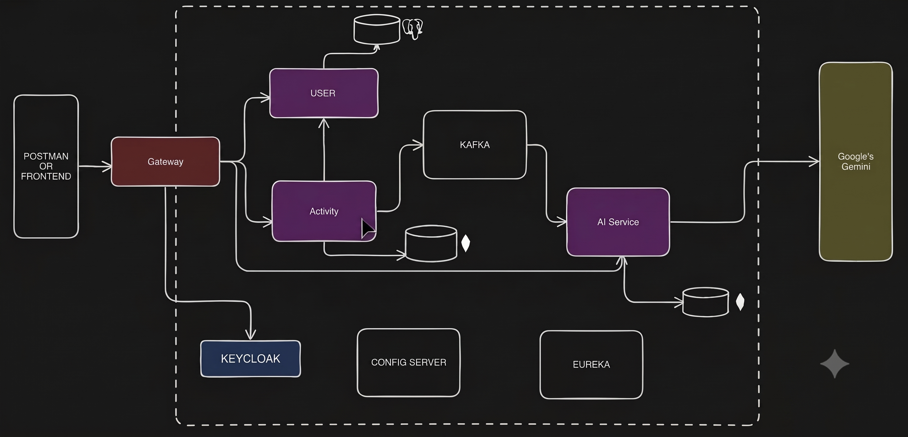

# 🏋️ Fitness Microservices Platform

> A production-grade, AI-powered fitness tracking backend built with a full Spring Cloud microservices architecture. Users log workouts; the system validates identity through Keycloak, persists activity data, streams it asynchronously via Apache Kafka, and delivers personalized AI-generated coaching insights powered by Google Gemini / OpenAI — all behind a reactive API Gateway secured with OAuth2 JWT.

---

## 📑 Table of Contents

1. [Problem Statement](#-problem-statement)
2. [What It Solves & How](#-what-it-solves--how)
3. [System Architecture](#-system-architecture)
4. [Service Breakdown](#-service-breakdown)
5. [Data Flow](#-data-flow)
6. [Technology Stack](#-technology-stack)
7. [API Reference](#-api-reference)
8. [Project Structure](#-project-structure)
9. [Local Setup & Configuration](#-local-setup--configuration)
10. [Key Design Decisions](#-key-design-decisions)
11. [Learnings](#-learnings)
12. [Future Improvements](#-future-improvements)

---

## 🧩 Problem Statement

Modern fitness apps collect enormous volumes of user workout data, but they rarely act on it intelligently in real time. The core problems this project addresses:

1. **Monolith scalability** — A single deployable unit cannot scale only the high-demand AI recommendation layer independently from user authentication or data ingestion.
2. **Tight coupling between tracking and AI inference** — If the AI recommendation call is synchronous, a slow LLM API stalls the user's request entirely.
3. **Identity fragmentation** — Managing user sessions separately in each service leads to inconsistent auth, duplication, and security holes.
4. **No actionable feedback loop** — Most fitness apps log data but do not close the loop with per-workout, context-aware coaching advice.

---

## ✅ What It Solves & How

| Problem | Solution |
|---|---|
| Monolith bottleneck | Decomposed into 5 independently deployable Spring Boot services |
| Blocking AI calls | Apache Kafka decouples activity ingestion from AI processing — zero wait time for the user |
| Distributed identity | Keycloak as the single Identity Provider (IdP); Gateway syncs users automatically on first request |
| No coaching loop | AI Service consumes activity events, calls Gemini/OpenAI, and persists structured recommendations |
| Config sprawl | Spring Cloud Config Server serves all service configs from a single source of truth |
| Service discovery | Netflix Eureka eliminates hardcoded URLs; services discover each other by name |

---

## 🏗 System Architecture

```
┌──────────────────────────────────────────────────────────────────────┐
│                         CLIENT LAYER                                 │
│         Postman / React Frontend (Vite + Redux + OAuth2 PKCE)        │
└──────────────────────────┬───────────────────────────────────────────┘
                           │  HTTPS + Bearer JWT
                           ▼
┌──────────────────────────────────────────────────────────────────────┐
│              SPRING CLOUD API GATEWAY  :8080                         │
│  • OAuth2 Resource Server  (JWT validation against Keycloak JWKS)    │
│  • KeycloakUserSyncFilter  (auto-registers new users downstream)     │
│  • Route: /api/users/**          → user-service                      │
│  • Route: /api/activities/**     → activity-service                  │
│  • Route: /api/recommendations/** → ai-service                       │
│  • CORS: localhost:5173                                               │
└───────────┬───────────────────────┬──────────────────────────────────┘
            │                       │
            ▼                       ▼
┌───────────────────┐   ┌───────────────────────────────────────────┐
│   USER SERVICE    │   │          ACTIVITY SERVICE :8082           │
│      :8081        │   │                                           │
│  Spring Boot MVC  │   │  Spring Boot MVC + WebFlux               │
│  Spring Data JPA  │◄──│  UserValidationService (WebClient)       │
│  PostgreSQL DB    │   │  Spring Data MongoDB (activities coll.)  │
│                   │   │  KafkaTemplate → publishes Activity event│
└───────────────────┘   └───────────────┬───────────────────────────┘
                                        │  Kafka Topic: activity-topic
                                        ▼
                         ┌──────────────────────────────────────────┐
                         │         AI SERVICE  :8083                │
                         │                                          │
                         │  @KafkaListener (activity-processor-grp)│
                         │  ActivityAiService → builds AI prompt   │
                         │  OpenAiService (WebClient) → Gemini/GPT │
                         │  Parses JSON → Recommendation model     │
                         │  Spring Data MongoDB (recommendations)  │
                         └──────────────────────────────────────────┘

─────────────────── INFRASTRUCTURE LAYER ────────────────────────────
  Keycloak :8181          Eureka :8761          Config Server :8888
  (realm: fitness-app)    (Service Registry)    (native classpath)
─────────────────────────────────────────────────────────────────────
```

---

## 🔬 Service Breakdown

### 1. `api-gateway` — Spring Cloud Gateway (Reactive / WebFlux)

The single entry point for all client traffic. Built on Spring WebFlux (non-blocking I/O) so it can handle high concurrency without thread-per-request overhead.

**Responsibilities:**
- **JWT Validation** via `spring-boot-starter-oauth2-resource-server`. Every request must carry a valid Bearer token issued by Keycloak. The gateway validates the signature against the Keycloak JWKS endpoint without any shared secret.
- **Keycloak→DB User Sync** via `KeycloakUserSyncFilter`. On each authenticated request, the filter decodes the JWT using `com.nimbusds:nimbus-jose-jwt` to extract `sub`, `email`, `given_name`, `family_name`, and calls the User Service to register the user if they do not exist yet. This eliminates the need for a separate registration flow.
- **Header Injection** — After sync, the filter mutates the downstream request to inject `X-User-ID: <keycloak-sub>`, so inner services never need to re-parse the JWT.
- **Load-balanced Routing** — Routes are resolved via Eureka (`lb://user-service`) with Spring Cloud LoadBalancer.
- **CORS** — Configured to accept requests from `http://localhost:5173`.

---

### 2. `user-service` — Spring Boot MVC + PostgreSQL

Owns the user domain: registration, profile lookup, and existence validation.

**Key Details:**
- Persists users in **PostgreSQL** via Spring Data JPA. The `User` entity stores both the local `id` (UUID generated by the DB) and `keycloakId` (the Keycloak `sub` claim).
- The `/api/users/{userId}/validate` endpoint is the internal contract consumed by the Activity Service, returning a simple `Boolean`.
- Registration is **idempotent** — if a user with the email already exists, it returns the existing record instead of throwing a conflict error.

**Endpoints:**

| Method | Path | Description |
|---|---|---|
| `POST` | `/api/users/register` | Register new user (called by Gateway filter) |
| `GET` | `/api/users/{userId}` | Fetch user profile |
| `GET` | `/api/users/{userId}/validate` | Internal: check if userId exists |

---

### 3. `activity-service` — Spring Boot MVC + MongoDB + Kafka Producer

The core ingestion service. Accepts workout submissions and drives the async AI pipeline.

**Key Details:**
- Stores activities in **MongoDB** (`activities` collection). Schema-less storage is ideal because `additionalMetrics` is a free-form `Map<String, Object>` that varies by activity type (e.g., pace and elevation for running vs. sets and reps for weight training).
- Before persisting, calls `UserValidationService` which makes a synchronous `WebClient` call to `user-service` to confirm the userId is legitimate using Eureka-based load balancing.
- After saving, publishes the full `Activity` document to Kafka using `KafkaTemplate<String, Activity>`. The message key is `userId`, ensuring all activities from the same user land in the same partition (ordering guarantee per user).
- The Kafka publish is wrapped in a `try-catch` so a Kafka broker issue never fails the user's tracking request.

**Supported Activity Types:** `RUNNING`, `WALKING`, `CYCLING`, `SWIMMING`, `WEIGHT_TRAINING`, `YOGA`, `HIIT`, `CARDIO`, `STRETCHING`, `OTHER`

**Endpoints:**

| Method | Path | Header Required | Description |
|---|---|---|---|
| `POST` | `/api/activities` | `X-User-ID` | Log a new activity |
| `GET` | `/api/activities` | `X-User-ID` | Fetch all activities for user |

---

### 4. `ai-service` — Spring Boot MVC + Kafka Consumer + MongoDB + WebClient

The intelligence layer. Fully event-driven — it does not expose write endpoints; it only reacts to Kafka messages.

**Key Details:**
- `ActivityMessageListener` is a `@KafkaListener` on the activity topic (`groupId: activity-processor-group`). It receives deserialized `Activity` objects directly.
- `ActivityAiService` constructs a structured JSON prompt with activity metadata (type, duration, calories, additional metrics) and sends it to the LLM.
- `OpenAiService` uses Spring WebFlux `WebClient` to call the AI API. Compatible with OpenAI Responses API format and configurable to point at Google Gemini.
- The LLM response is expected in a strict JSON schema with `analysis`, `improvements`, `suggestions`, and `safety` sections. Parsed with Jackson `JsonNode` tree traversal, gracefully falling back to a default recommendation on parse failure.
- The resulting `Recommendation` document is persisted in MongoDB (`recommendations` collection), linked to both `activityId` and `userId`.

**Recommendation Schema:**
```json
{
  "activityId": "...",
  "userId": "...",
  "type": "RUNNING",
  "recommendation": "Overall: ... Pace: ... Heart Rate: ... Calories: ...",
  "improvements": ["Cadence: Increase your step rate to reduce injury risk"],
  "suggestions": ["Tempo Run: 20 minutes at a comfortably hard pace"],
  "safety": ["Always warm up for 5 minutes before high-intensity sessions"]
}
```

**Endpoints:**

| Method | Path | Description |
|---|---|---|
| `GET` | `/api/recommendations/user/{userId}` | All recommendations for a user |
| `GET` | `/api/recommendations/activity/{activityId}` | Recommendation for a specific activity |

---

### 5. `configserver` — Spring Cloud Config Server (Native)

Serves externalized configuration to all microservices at startup. Runs on port `8888`. Uses the `native` profile, serving configs from the classpath (`resources/config/`). Each service bootstraps with `spring.config.import=optional:configserver:http://localhost:8888`.

---

### 6. `eureka` — Netflix Eureka Server

Service registry running on port `8761`. All other services register as Eureka clients. The Gateway resolves downstream service addresses using `lb://service-name` URIs — zero hardcoded IPs.

---

### 7. `fitness-frontend` — React 19 + Vite + Redux Toolkit

**Key Features:**
- **OAuth2 PKCE flow** via `react-oauth2-code-pkce` pointing at `http://localhost:8181/realms/fitness-app`. No client secrets stored in the browser.
- **Redux Toolkit** for global auth state (`authSlice`) with token and user data.
- **Chart.js** for analytics visualizations.
- **Recommendation polling** (`useRecommendationPolling` hook) — after logging an activity, the frontend polls `/api/recommendations/activity/{id}` until the AI recommendation is ready, then fires a toast notification.
- Pages: `Dashboard`, `ActivitiesTimeline`, `ActivityReport`, `AnalyticsPage`, `ProfilePage`, `LandingPage`.

---

## 🔄 Data Flow

### Flow 1: User First Login (Auto-registration)

```
Browser ──[Keycloak PKCE login]──► Keycloak issues JWT
Browser ──[GET /api/activities + Bearer JWT]──► API Gateway
Gateway: Validates JWT signature (JWKS from Keycloak)
Gateway: KeycloakUserSyncFilter decodes JWT → extracts sub, email, name
Gateway: WebClient GET lb://user-service/api/users/{sub}/validate → false
Gateway: WebClient POST lb://user-service/api/users/register → 200 OK
Gateway: Injects X-User-ID header → routes to downstream service
```

### Flow 2: Logging a Workout

```
Client ──POST /api/activities { type, duration, calories, metrics }──► Gateway
Gateway validates JWT, injects X-User-ID header
Activity Service receives request
  └─► UserValidationService.validateUser(userId)
          └─► WebClient GET lb://user-service/api/users/{id}/validate → true
  └─► Builds Activity document, saves to MongoDB
  └─► KafkaTemplate.send("activity-topic", userId, activity)  ← fire & forget
  └─► Returns ActivityResponse to client  ← user gets instant response
```

### Flow 3: AI Recommendation Generation (Async)

```
Kafka Broker ──[activity-topic]──► AI Service (ActivityMessageListener)
  └─► ActivityAiService.generateRecommendation(activity)
        └─► createPromptForActivity(type, duration, calories, metrics)
        └─► OpenAiService.getRecommendations(prompt)
              └─► WebClient POST → Gemini/OpenAI API
              └─► Returns structured JSON
        └─► Parse JSON (analysis, improvements, suggestions, safety)
        └─► Build Recommendation document
  └─► RecommendationRepository.save(recommendation) → MongoDB
Frontend polls GET /api/recommendations/activity/{id} → gets result
```

### Flow 4: Viewing AI Recommendations

```
Client ──GET /api/recommendations/activity/{activityId}──► Gateway
Gateway validates JWT + injects X-User-ID
AI Service: RecommendationRepository.findByActivityId(id) → MongoDB
Returns structured Recommendation JSON → Frontend displays insights
```

---

## 🛠 Technology Stack

| Layer | Technology | Version |
|---|---|---|
| Language | Java | 21–25 |
| Framework | Spring Boot | 3.5.9 / 4.0.0 |
| Cloud | Spring Cloud (Eureka, Config, Gateway) | 2025.0.x / 2025.1.x |
| API Gateway | Spring Cloud Gateway (WebFlux) | — |
| Auth / IdP | Keycloak | 26.x |
| Messaging | Apache Kafka | — |
| Relational DB | PostgreSQL | — |
| Document DB | MongoDB | — |
| ORM | Spring Data JPA (Hibernate) | — |
| Reactive HTTP | Spring WebFlux / WebClient | — |
| AI Integration | OpenAI / Google Gemini (via REST) | — |
| Build | Apache Maven | — |
| Boilerplate | Lombok | — |
| Frontend | React 19 + Vite 7 | — |
| State Mgmt | Redux Toolkit | — |
| Auth (FE) | react-oauth2-code-pkce (PKCE) | — |
| Charts | Chart.js + react-chartjs-2 | — |

---

## 📡 API Reference

All routes go through the **API Gateway on port `8080`**.  
Every request must include: `Authorization: Bearer <JWT_FROM_KEYCLOAK>`

### User Service Routes
```
POST   /api/users/register           – Register a user (invoked by Gateway sync filter)
GET    /api/users/{userId}           – Get user profile
GET    /api/users/{userId}/validate  – Check user existence (internal use)
```

### Activity Service Routes
```
POST   /api/activities               – Log a new workout activity
GET    /api/activities               – Get all activities for authenticated user
```

**Sample Request Body — Log Activity:**
```json
{
  "type": "RUNNING",
  "duration": 45,
  "caloriesBurnt": 520,
  "startTime": "2026-09-14T07:00:00",
  "additionalMetrics": {
    "distance_km": 7.2,
    "avg_pace_min_per_km": 6.25,
    "avg_heart_rate_bpm": 158,
    "elevation_gain_m": 80
  }
}
```

### AI / Recommendation Service Routes
```
GET    /api/recommendations/user/{userId}         – All recommendations for user
GET    /api/recommendations/activity/{activityId} – Recommendation for a specific activity
```

---

## 📁 Project Structure

```
Fitness-microservices/
├── eureka/                     # Netflix Eureka Service Registry  (port 8761)
├── configserver/               # Spring Cloud Config Server        (port 8888)
│   └── src/main/resources/config/
│       ├── user-service.properties
│       ├── activity-service.properties
│       ├── ai-service.properties
│       └── api-gateway.properties
├── gateway/                    # API Gateway + Security + Sync     (port 8080)
│   └── src/main/java/.../gateway/
│       ├── SecurityConfig.java           # OAuth2 JWT + CORS
│       ├── KeycloakUserSyncFilter.java   # Auto user registration
│       └── user/                         # WebClient to user-service
├── userservice/                # User Domain                       (port 8081)
│   └── src/main/java/.../userservice/
│       ├── models/User.java
│       ├── controller/UserController.java
│       ├── services/UserService.java
│       └── repository/UserRepository.java
├── activityservice/            # Activity Tracking + Kafka Pub     (port 8082)
│   └── src/main/java/.../activityservice/
│       ├── model/Activity.java
│       ├── controller/ActivityController.java
│       ├── service/ActivityService.java        # Core logic + Kafka producer
│       └── service/UserValidationService.java  # WebClient to user-service
├── aiservice/                  # AI Recommendations + Kafka Sub    (port 8083)
│   └── src/main/java/.../aiservice/
│       ├── model/Recommendation.java
│       ├── service/ActivityMessageListener.java  # @KafkaListener
│       ├── service/ActivityAiService.java         # Prompt building + response parsing
│       ├── service/OpenAiService.java             # WebClient → LLM API
│       └── controller/RecommendationController.java
└── fitness-frontend/           # React 19 SPA (Vite)
    └── src/
        ├── pages/              # Dashboard, Activities, Analytics, Profile
        ├── components/         # Navbar, ActivityLauncher, Toast
        ├── hooks/              # useToast, useRecommendationPolling
        ├── store/              # Redux authSlice
        └── services/           # Axios API clients
```

---

## ⚙️ Local Setup & Configuration

### Prerequisites

| Dependency | Version | Notes |
|---|---|---|
| Java JDK | 21+ | Tested up to Java 25 |
| Apache Maven | 3.9+ | |
| Docker + Docker Compose | Latest | For Kafka, PostgreSQL, MongoDB, Keycloak |
| Node.js | 20+ | For the frontend |

### Step 1: Start Infrastructure with Docker

```yaml
# docker-compose.yml (create in project root)
version: '3.8'
services:
  postgres:
    image: postgres:16
    environment:
      POSTGRES_DB: fitness_users
      POSTGRES_USER: postgres
      POSTGRES_PASSWORD: postgres
    ports:
      - "5432:5432"

  mongodb:
    image: mongo:7
    ports:
      - "27017:27017"

  zookeeper:
    image: confluentinc/cp-zookeeper:7.6.0
    environment:
      ZOOKEEPER_CLIENT_PORT: 2181

  kafka:
    image: confluentinc/cp-kafka:7.6.0
    depends_on: [zookeeper]
    ports:
      - "9092:9092"
    environment:
      KAFKA_BROKER_ID: 1
      KAFKA_ZOOKEEPER_CONNECT: zookeeper:2181
      KAFKA_ADVERTISED_LISTENERS: PLAINTEXT://localhost:9092
      KAFKA_OFFSETS_TOPIC_REPLICATION_FACTOR: 1

  keycloak:
    image: quay.io/keycloak/keycloak:26.0
    command: start-dev
    environment:
      KEYCLOAK_ADMIN: admin
      KEYCLOAK_ADMIN_PASSWORD: admin
    ports:
      - "8181:8080"
```

```bash
docker compose up -d
```

### Step 2: Configure Keycloak

1. Navigate to `http://localhost:8181` → Admin console (`admin` / `admin`)
2. Create a new **Realm**: `fitness-app`
3. Create a **Client**: `oauth2-pkce-client`
   - Client authentication: **OFF** (public client)
   - Valid redirect URIs: `http://localhost:5173/*`
   - Web origins: `http://localhost:5173`
4. Enable **Standard Flow** (Authorization Code + PKCE)
5. In Realm Settings → Token → enable email, given_name, family_name claims in the ID Token

### Step 3: Configure the Config Server

Add the following files under `configserver/src/main/resources/config/`:

**`user-service.properties`**
```properties
spring.datasource.url=jdbc:postgresql://localhost:5432/fitness_users
spring.datasource.username=postgres
spring.datasource.password=postgres
spring.jpa.hibernate.ddl-auto=update
server.port=8081
eureka.client.service-url.defaultZone=http://localhost:8761/eureka
```

**`activity-service.properties`**
```properties
spring.data.mongodb.uri=mongodb://localhost:27017/fitness_activities
server.port=8082
eureka.client.service-url.defaultZone=http://localhost:8761/eureka
spring.kafka.bootstrap-servers=localhost:9092
kafka.topic.name=activity-topic
spring.kafka.producer.key-serializer=org.apache.kafka.common.serialization.StringSerializer
spring.kafka.producer.value-serializer=org.springframework.kafka.support.serializer.JsonSerializer
```

**`ai-service.properties`**
```properties
spring.data.mongodb.uri=mongodb://localhost:27017/fitness_ai
server.port=8083
eureka.client.service-url.defaultZone=http://localhost:8761/eureka
spring.kafka.bootstrap-servers=localhost:9092
kafka.topic.name=activity-topic
spring.kafka.consumer.group-id=activity-processor-group
spring.kafka.consumer.key-deserializer=org.apache.kafka.common.serialization.StringDeserializer
spring.kafka.consumer.value-deserializer=org.springframework.kafka.support.serializer.JsonDeserializer
spring.kafka.consumer.properties.spring.json.trusted.packages=*
openai.api.key=YOUR_OPENAI_OR_GEMINI_KEY
openai.api.url=https://api.openai.com/v1/responses
```

**`api-gateway.properties`**
```properties
server.port=8080
eureka.client.service-url.defaultZone=http://localhost:8761/eureka
spring.security.oauth2.resourceserver.jwt.jwk-set-uri=http://localhost:8181/realms/fitness-app/protocol/openid-connect/certs
spring.cloud.gateway.routes[0].id=user-service
spring.cloud.gateway.routes[0].uri=lb://user-service
spring.cloud.gateway.routes[0].predicates[0]=Path=/api/users/**
spring.cloud.gateway.routes[1].id=activity-service
spring.cloud.gateway.routes[1].uri=lb://activity-service
spring.cloud.gateway.routes[1].predicates[0]=Path=/api/activities/**
spring.cloud.gateway.routes[2].id=ai-service
spring.cloud.gateway.routes[2].uri=lb://ai-service
spring.cloud.gateway.routes[2].predicates[0]=Path=/api/recommendations/**
```

### Step 4: Start Services (in order)

```bash
# 1. Eureka — must be first
cd eureka && mvn spring-boot:run

# 2. Config Server — must be before all other services
cd configserver && mvn spring-boot:run

# 3. User Service
cd userservice && mvn spring-boot:run

# 4. Activity Service
cd activityservice && mvn spring-boot:run

# 5. AI Service
cd aiservice && mvn spring-boot:run

# 6. API Gateway — start last
cd gateway && mvn spring-boot:run
```

### Step 5: Start the Frontend

```bash
cd fitness-frontend
npm install
npm run dev
# Opens at http://localhost:5173
```

### Service Port Reference

| Service | Port |
|---|---|
| Keycloak | 8181 |
| Eureka Dashboard | 8761 |
| Config Server | 8888 |
| API Gateway | 8080 |
| User Service | 8081 |
| Activity Service | 8082 |
| AI Service | 8083 |
| React Frontend | 5173 |

---

## 🧠 Key Design Decisions

### 1. Why Kafka instead of direct HTTP from Activity → AI Service?
Kafka decouples the two services both in time and in reliability. A `POST /api/activities` returns in ~50ms (MongoDB write + Kafka publish). The AI call to Gemini/OpenAI can take 2–8 seconds. Making it synchronous would be unacceptable UX. With Kafka, the Activity Service never knows whether the AI Service is up, slow, or processing a backlog — it just publishes and moves on. The AI Service scales horizontally simply by adding more consumer instances in the same `groupId`.

### 2. Why MongoDB for activities and recommendations?
Activities have a flexible `additionalMetrics: Map<String, Object>` field that is fundamentally schema-less. Different exercise types (running vs. weight training) produce completely different metric shapes. A rigid relational schema would require a very wide table with many NULLs, or a complex EAV model. MongoDB's document model is a natural fit. Recommendations are also hierarchical JSON documents (nested arrays of improvements/suggestions) that map cleanly to BSON.

### 3. Why PostgreSQL for users?
User profiles are highly relational with transactional write requirements (uniqueness constraints on email and keycloakId). PostgreSQL's ACID guarantees and unique index support are the right tool here. This is **polyglot persistence** — using the best database for each domain's access pattern.

### 4. Gateway-level user synchronization via `KeycloakUserSyncFilter`
Instead of requiring the frontend to make a separate registration call after login, the filter handles synchronization transparently on the first authenticated request. This is a **reactive `WebFilter`** (not a blocking servlet filter), preserving the Gateway's non-blocking nature. The filter:
1. Extracts user details from the JWT (no Keycloak roundtrip needed)
2. Checks existence against the User Service
3. Registers if new
4. Injects `X-User-ID` header regardless

### 5. `X-User-ID` header pattern for internal identity propagation
Rather than making every downstream service re-validate the JWT, the Gateway validates once and injects a trusted `X-User-ID` header. Inner services trust this header because they are not externally accessible (hidden behind the Gateway). This follows the **"trust the boundary"** pattern common in internal service meshes.

### 6. Idempotent user registration
`UserService.register()` checks for an existing email before inserting. This is critical because the Gateway sync filter runs on every authenticated request, not just the first. Without idempotency, a user's second API call would fail with a unique constraint violation.

### 7. Graceful AI fallback
`ActivityAiService` catches any exception during JSON parsing and returns a `createDefaultRecommendation()` instead of propagating the error. This means the Recommendation is always persisted — even if the AI response was malformed. The user always gets something useful.

---

## 📚 Learnings

### Spring Cloud Ecosystem
- **Config Server boot ordering** matters critically. Services fail to start if the Config Server is not ready when they bootstrap. The `optional:` prefix in `spring.config.import` is a key escape hatch for local development — services can start without the Config Server but will use only local properties.
- **Eureka propagation delay** — Newly registered services may not be immediately visible to the Gateway's route resolver. A ~30 second warm-up is normal. The `preferIpAddress` setting can help in Docker environments.
- **Spring Cloud Gateway vs. Zuul** — Gateway is built on WebFlux (Project Reactor), making it fully non-blocking. This required using `WebFilter` instead of servlet filters and thinking in `Mono`/`Flux` chains throughout.

### Reactive Programming
- Mixing blocking (`WebClient.block()`) and reactive (`Mono`) code in the same thread pool can cause deadlocks in a WebFlux context. The Gateway's `KeycloakUserSyncFilter` must return a `Mono<Void>` chain and must never call `.block()` internally — every async operation must be composed with `.flatMap()`, `.then()`, or `.defer()`.
- In the Activity and AI Services (which are MVC-based on a thread-pool servlet container), `WebClient.block()` is safe and appropriate.

### Kafka in Practice
- **Message serialization** — Using `JsonSerializer` for the producer and `JsonDeserializer` on the consumer requires `spring.json.trusted.packages=*` to allow deserialization of custom domain classes across service boundaries (different JARs/classloaders).
- **Consumer group semantics** — Only one consumer instance in a group processes each partition. This is exactly the desired behavior: one AI recommendation generated per activity, not one per service replica.
- **Kafka as a safety net** — Wrapping `kafkaTemplate.send()` in a try-catch ensures a Kafka broker outage never corrupts user data. Activity data is always persisted; the AI recommendation is generated later when Kafka recovers and the consumer catches up.
- **Message key selection** — Using `userId` as the Kafka message key guarantees that all activities from the same user are ordered within a partition. This is foundational for future trend-analysis features.

### Keycloak & OAuth2
- **PKCE (Proof Key for Code Exchange)** is the correct OAuth2 flow for SPAs — no client secret is stored in the browser. The library generates a random code verifier, hashes it (S256), and sends the hash with the authorization request.
- **JWT claim extraction** with Nimbus JOSE+JWT allows the Gateway to read user details from the token without a Keycloak roundtrip — the public key validates the signature locally using the cached JWKS.
- **Realm claim mapping** — `email`, `given_name`, and `family_name` must be explicitly added to the ID Token via Keycloak client scope configuration. They are not included by default.
- **Token refresh** — The `react-oauth2-code-pkce` library handles silent token refresh using the `offline_access` scope (refresh tokens). When the refresh token expires, `onRefreshTokenExpire` re-triggers the login flow.

### Database Polyglot Persistence
- **MongoDB** `@CreatedDate` / `@LastModifiedDate` requires enabling auditing via `@EnableMongoAuditing` on a `@Configuration` class — it does not work with just the annotations alone.
- The `@Field("metrics")` annotation on `additionalMetrics` demonstrates that the Java field name and MongoDB field name do not need to match — useful for keeping Java naming conventions while controlling the stored document shape.

---

## 🚀 Future Improvements

### Technical Enhancements

| Area | Improvement |
|---|---|
| **Observability** | Add Micrometer + Prometheus metrics, Zipkin/Sleuth distributed tracing across service calls and Kafka events |
| **Resilience** | Implement Resilience4j Circuit Breaker on `UserValidationService` WebClient calls and AI Service HTTP calls to prevent cascade failures |
| **API Versioning** | Add `/v1/` prefix to all routes and implement version negotiation at the Gateway |
| **API Documentation** | Integrate SpringDoc OpenAPI / Swagger UI per service, aggregated at the Gateway |
| **Containerization** | Add a `Dockerfile` per service and a root `docker-compose.yml` covering all services, enabling one-command local startup |
| **Event Sourcing** | Replace direct MongoDB writes in the Activity Service with an event-sourced pattern using Kafka topics as the system of record |
| **Dead Letter Queue** | Configure a Kafka DLQ for messages the AI Service fails to process, with exponential retry backoff |
| **Rate Limiting** | Add `RequestRateLimiter` filter at the Gateway using Redis to prevent abuse of the AI endpoint |
| **Caching** | Add Redis caching for user validation results in the Activity Service to reduce inter-service HTTP calls |

### Feature Enhancements

| Feature | Description |
|---|---|
| **Goal Tracking** | Allow users to define weekly/monthly fitness goals and track progress against them |
| **AI Trend Analysis** | Beyond per-workout recommendations, generate weekly trends comparing recent performance against historical data |
| **Push Notifications** | Use WebSockets or Server-Sent Events to push AI recommendations to the frontend instead of client-side polling |
| **Wearable Integration** | Add an ingestion adapter for Fitbit / Garmin / Apple Health APIs |
| **Social Features** | Activity sharing, friend comparisons, leaderboards — would require a dedicated `social-service` |
| **Notification Service** | A dedicated service for email/push notifications triggered by Kafka events |

### Infrastructure & DevOps

| Area | Improvement |
|---|---|
| **CI/CD** | GitHub Actions pipeline: test → build → Docker build → push to registry |
| **Kubernetes** | Helm charts for deploying all services to a K8s cluster; HPA for the AI Service (scale on Kafka consumer lag) |
| **Secrets Management** | Replace plaintext `openai.api.key` in config files with HashiCorp Vault or AWS Secrets Manager integration |
| **Config Server** | Migrate from native file-based config to a Git-backed Config Server repository for audit trail and history |
| **Service Mesh** | Introduce Istio or Linkerd for mTLS between internal services, removing the need to trust the `X-User-ID` header |

---

## 👤 Author

**Gourav Nahar**  
Java Backend & Cloud Architecture | Spring Boot Microservices | Kafka | Keycloak | AI Integration

---

*Built with Java 21+, Spring Boot 4.0, Spring Cloud 2025, Apache Kafka, Keycloak, Google Gemini, React 19, and a lot of coffee ☕*
